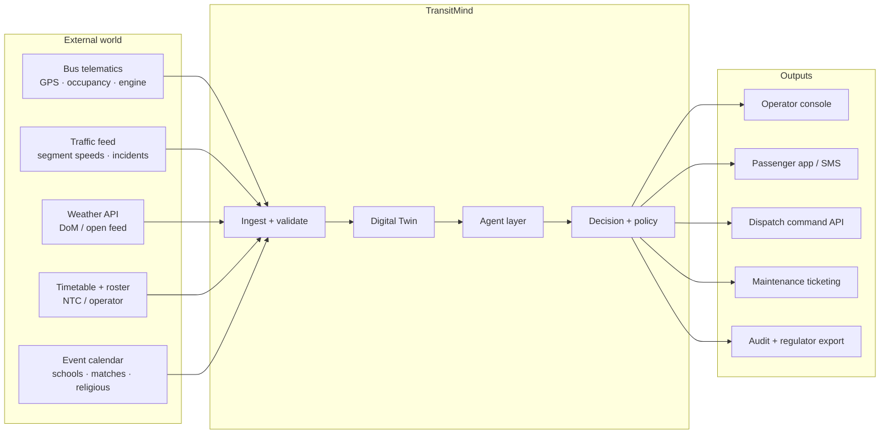

# spec.md — Inputs, Outputs, Interfaces and Constraints

Companion to `CLAUDE.md`. Where `CLAUDE.md` says *what the system is*, this file says *what crosses its boundaries*.

---

## 1. System boundary



---

## 2. Inputs

### 2.1 Vehicle telemetry (primary, high frequency)

Transport: MQTT over TLS, QoS 1. Topic: `transitmind/v1/telemetry/{operator_id}/{bus_id}`. Interval: 5 s.

```json
{
  "schema_version": "1.0",
  "bus_id": "NB-4721",
  "operator_id": "LMT",
  "route_id": "138",
  "trip_id": "138-DN-0715",
  "timestamp": "2026-09-04T07:22:15+05:30",
  "position": { "lat": 6.8649, "lon": 79.8997, "heading": 312, "speed_kmh": 18.4 },
  "occupancy": { "count": 54, "seated_capacity": 34, "total_capacity": 60, "confidence": 0.93 },
  "health": {
    "engine_temp_c": 91.5,
    "coolant_pressure_kpa": 108,
    "brake_wear_pct": 62,
    "battery_voltage": 27.1,
    "fuel_level_pct": 41,
    "engine_hours": 18422,
    "dtc_codes": []
  },
  "driver": { "duty_id": "D-3391", "harsh_brake_events_10min": 2, "overspeed_events_10min": 0 },
  "device": { "firmware": "2.3.1", "signal_dbm": -71, "signature": "<ed25519-sig>" }
}
```

Every field is validated on ingest against `iot/telemetry/schema.json`. Messages failing schema, signature, or plausibility checks are quarantined, never silently dropped.

### 2.2 Traffic and road network

Segment-level travel times on the corridor graph, plus incident events (accident, closure, procession, waterlogging). Interval 60 s. Sources in production: operator probe data from its own fleet (TransitMind's buses *are* traffic probes), plus a commercial or open traffic API, plus a manual incident entry channel for the depot controller.

### 2.3 Weather

Rainfall intensity, flood warnings, and visibility by district. Colombo's corridors have known waterlogging points; the Traffic Agent holds a static map of these and raises segment risk when rainfall crosses a threshold.

### 2.4 Schedule, roster, and fleet register

Planned trips, assigned vehicles, driver duty windows, spare-bus pool with location and readiness state. This is the only input class with a **hard** dependency: without a roster the Decision Agent cannot plan and refuses to run.

### 2.5 Demand context

Historical boarding profiles by stop / time-of-day / day-type, school and university terms, public and religious holidays, stadium and venue events, and — where available — tap-in/tap-out counts from digital ticketing.

---

## 3. Outputs

### 3.1 Prediction record

```json
{
  "prediction_id": "PRD-2026-09-04-004417",
  "agent": "demand_agent",
  "subject": { "type": "trip", "route_id": "138", "trip_id": "138-DN-0745" },
  "horizon_min": 20,
  "metric": "load_factor",
  "value": 1.12,
  "confidence": 0.84,
  "confidence_interval": [0.97, 1.28],
  "evidence": [
    "tap-in rate at Maharagama +38% vs 4-week weekday median",
    "upstream trip 138-DN-0730 departed Kottawa at load factor 0.97",
    "rainfall 11 mm/h — historical modal shift from three-wheeler to bus"
  ],
  "created_at": "2026-09-04T07:25:03+05:30"
}
```

### 3.2 Situation record

Opened when a prediction breaches a threshold. Carries the `situation_id` that binds every downstream artefact.

### 3.3 Decision record

```json
{
  "situation_id": "SIT-2026-09-04-0113",
  "decision_id": "DEC-2026-09-04-0113-1",
  "recommended_action": "DEPLOY_SPARE_BUS",
  "parameters": { "bus_id": "NB-4802", "route_id": "138", "inject_at_stop": "Maharagama", "target_departure": "07:41" },
  "risk_tier": "MEDIUM",
  "authority_required": "human_approval",
  "contributing_agents": ["demand_agent", "traffic_agent", "fleet_agent", "safety_agent"],
  "options_considered": [
    { "option": "DO_NOTHING", "projected_stranded": 143, "projected_added_wait_min": 12.4, "cost_lkr": 0 },
    { "option": "DEPLOY_SPARE_BUS", "projected_stranded": 18, "projected_added_wait_min": 3.1, "cost_lkr": 5800 },
    { "option": "SHORT_TURN_UPSTREAM", "projected_stranded": 61, "projected_added_wait_min": 6.8, "cost_lkr": 900 }
  ],
  "rationale": "Deploy dominates on passenger-minutes saved (1,190 vs 0) at 5,800 LKR marginal cost; short-turn is cheaper but strands 61 passengers on the outer segment.",
  "safety_verdict": { "agent": "safety_agent", "verdict": "PERMIT", "checks_passed": ["command_allowlisted", "driver_hours_ok", "vehicle_roadworthy", "no_active_incident_on_path"] },
  "created_at": "2026-09-04T07:25:41+05:30"
}
```

**Every decision record must state its `options_considered`.** A recommendation with no rejected alternatives is not a decision, it is a reflex.

### 3.4 Passenger notification

Plain, honest, and never over-promising:

> **Route 138 — Maharagama to Fort**
> An extra bus has been added, departing Maharagama at 07:41.
> Next bus: 4 min · Occupancy: **High** · Following bus: 9 min · Occupancy: **Medium**
> Reason: higher-than-usual demand this morning.

Occupancy is published as a band (Low / Medium / High / Full), never a raw count — an exact count invites the inference that individuals are being tracked.

### 3.5 Audit record

Schema in `security/audit_logging/audit-schema.md`. Append-only, hash-chained, exportable to the regulator.

---

## 4. Constraints

### 4.1 Performance

| Property | Target |
|---|---|
| Telemetry ingest → twin state updated | < 2 s (p95) |
| Situation opened → ranked options ready | < 10 s (p95) |
| Twin simulation of one option | < 1.5 s |
| Operator approval → dispatch acknowledged | < 3 s |
| Console update latency (WebSocket) | < 500 ms |
| Prototype scale | 60 buses, 5 routes, 240 stops, 12 msg/s |
| Production target scale | 5,000 buses, 400 routes, ~1,000 msg/s |

### 4.2 Operating context constraints (Sri Lanka–specific)

- **Intermittent connectivity.** Mobile coverage on the corridors is generally good but not guaranteed. Devices buffer locally and replay on reconnect; the twin must handle out-of-order arrival.
- **Mixed operator landscape.** The Colombo network mixes SLTB, private operators, and the new Lanka Metro Transit fleet. TransitMind must work per-operator and never assume it can command a vehicle it does not have authority over. Cross-operator actions are **recommendations only**.
- **Retrofit reality.** Most existing buses have no occupancy sensor. The MVP treats occupancy as an *estimated* quantity fused from ticketing, door-cycle counts, and driver input, with confidence propagated all the way to the decision.
- **Low-bandwidth passengers.** The passenger channel must degrade to SMS and a sub-100 KB web page, not only a modern app.
- **Language.** Passenger-facing output must be available in Sinhala, Tamil, and English.

### 4.3 Legal and regulatory

- Route licensing and timetable authority rest with the National Transport Commission and Provincial Passenger Transport Authorities. TransitMind proposes; the licensed authority disposes.
- Vehicle withdrawal for safety reasons follows existing operator maintenance procedure — TransitMind raises the ticket, it does not deem a bus unroadworthy.
- Data protection: Sri Lanka's Personal Data Protection Act No. 9 of 2022 applies. TransitMind's answer is architectural — it stores no personal data at all, so most obligations do not attach. See `docs/07-cybersecurity-raid.md` §6.

### 4.4 Ethical constraints

- **No driver surveillance creep.** Driver-behaviour signals feed *safety* alerts only, are aggregated over a 10-minute window, and are never exposed as an individual performance ranking without an agreed operator–union policy.
- **No service redlining.** The optimiser is constrained so that no route may be de-prioritised below a floor service level, preventing the system from quietly optimising low-income outer corridors into worse service.
- **Explainability is mandatory.** Any passenger-visible or operator-visible decision must be explainable in one sentence of plain language.

---

## 5. Interface contracts

| Interface | Protocol | Direction | Auth |
|---|---|---|---|
| Telemetry ingest | MQTT 5 / TLS 1.3 | In | Per-device X.509 client cert + Ed25519 payload signature |
| Traffic / weather | HTTPS REST | In | API key in secret store, rotated 90 d |
| Operator console | HTTPS + WebSocket | Bi | OIDC + MFA, role-scoped JWT (15 min) |
| Passenger API | HTTPS REST | Out | Anonymous, rate-limited, cached at edge |
| Dispatch command | HTTPS REST, mTLS | Out | Service identity + per-request signed authorisation token |
| Maintenance ticketing | HTTPS REST | Out | Service account, write-only to ticket queue |
| Audit export | HTTPS REST | Out | Regulator role, read-only, hash-chain verifiable |

Full endpoint definitions: `docs/09-api-spec.md`.

---

## 6. Definition of done (MVP)

- [ ] Telemetry simulator emits schema-valid messages for 60 buses across 5 Colombo routes
- [ ] Twin reconstructs live network state and survives out-of-order and duplicate messages
- [ ] All five agents emit records with confidence and evidence
- [ ] Twin can simulate ≥ 3 options for a situation and rank them
- [ ] Safety Agent enforces the allowlist and correctly vetoes an out-of-catalogue action
- [ ] Risk tiering routes MEDIUM/HIGH to a human approval queue
- [ ] Audit log reconstructs any decision end to end
- [ ] `GLOBAL_HALT` verified to stop automated action within 2 s
- [ ] All four scenarios in `simulation/scenarios/` run reproducibly from a seed
